# VIP 도네이터 관리 — DB ERD (PostgreSQL)

`API_SPEC.md`의 데이터 모델을 정규화한 관계형 스키마입니다.

**설계 원칙**
- **멀티테넌트**: 모든 도메인 데이터는 `creators`(크리에이터)에 소속 → 대부분 테이블에 `creator_id`
- **정규화**: 태그·타입·칭호 수여·자동화 대상/액션은 별도 테이블로 분리
- **파생값 캐시**: 도네이터의 `cash`(누적)·`donation_count`·`grade_id`는 `donations`의 집계이지만, 조회 성능을 위해 캐시 컬럼으로 유지(웹훅/트리거로 동기화)
- **스냅샷 로그**: `automation_logs`는 발동 시점의 이름·등급을 denormalize해 보관(과거 이력 보존)
- **라이브 세션**: 접속/랭킹/피드는 휘발성 → Redis/WebSocket 메모리에서 관리(영속 테이블 아님). 필요 시 `broadcast_sessions`로 요약만 기록

---

## ERD

```mermaid
erDiagram
  CREATORS   ||--o{ GRADES : owns
  CREATORS   ||--o{ DONATORS : owns
  CREATORS   ||--o{ TITLES : owns
  CREATORS   ||--o{ AUTOMATIONS : owns
  CREATORS   ||--|| SETTINGS : has

  GRADES     |o--o{ DONATORS : "classifies (cache)"
  GRADES     |o--o{ TITLES : "grade-rule target"
  GRADES     ||--o{ AUTOMATION_TARGET_GRADES : targeted_by

  DONATORS   ||--o{ DONATIONS : receives
  DONATORS   ||--o{ DONATOR_TAGS : has
  DONATORS   ||--o{ DONATOR_TYPES : has
  DONATORS   ||--o{ DONATOR_AWARDS : earns
  DONATORS   ||--o{ AUTOMATION_TARGET_DONATORS : targeted_by
  DONATORS   |o--o{ AUTOMATION_LOGS : triggers
  DONATORS   ||--o{ NOTIFICATIONS : receives

  TAGS       ||--o{ DONATOR_TAGS : used_in
  TITLES     ||--o{ DONATOR_AWARDS : granted_via

  AUTOMATIONS ||--o{ AUTOMATION_ACTIONS : has
  AUTOMATIONS ||--o{ AUTOMATION_TARGET_GRADES : targets
  AUTOMATIONS ||--o{ AUTOMATION_TARGET_DONATORS : targets
  AUTOMATIONS ||--o{ AUTOMATION_DAYS : scheduled_on
  AUTOMATIONS |o--o{ AUTOMATION_LOGS : produces

  CREATORS {
    uuid id PK
    varchar name
    varchar email
    timestamptz created_at
  }
  SETTINGS {
    uuid creator_id PK "FK CREATORS"
    boolean anniv_auto
    timestamptz updated_at
  }
  GRADES {
    uuid id PK
    uuid creator_id FK
    varchar name
    varchar cls "vvip|vip|yeol|custom"
    varchar color
    varchar mode "over|range"
    bigint min_amount
    bigint max_amount "range일 때 사용, over면 0"
    smallint sort_order
  }
  DONATORS {
    uuid id PK
    uuid creator_id FK
    uuid grade_id FK "파생 캐시, nullable"
    varchar name
    varchar alias
    bigint cash "누적(파생 캐시)"
    int donation_count "파생 캐시"
    text memo
    boolean blocked
    text block_reason
    date blocked_at
    date join_date
    timestamptz last_donation_at
    boolean nudged
    boolean celebrated
    timestamptz created_at
  }
  DONATIONS {
    uuid id PK
    uuid donator_id FK
    bigint amount
    varchar kind "text|voice|signature|quest"
    text message
    timestamptz donated_at
  }
  TAGS {
    uuid id PK
    uuid creator_id FK
    varchar name
  }
  DONATOR_TAGS {
    uuid donator_id PK "FK"
    uuid tag_id PK "FK"
  }
  DONATOR_TYPES {
    uuid donator_id PK "FK"
    varchar type PK "text|signature|voice|quest"
  }
  TITLES {
    uuid id PK
    uuid creator_id FK
    varchar name
    varchar icon
    varchar color
    varchar rule_type "cumulative|count|single|grade|manual"
    bigint rule_n "임계값, nullable"
    uuid rule_grade_id FK "grade 규칙용, nullable"
  }
  DONATOR_AWARDS {
    uuid donator_id PK "FK"
    uuid title_id PK "FK"
    timestamptz awarded_at
  }
  AUTOMATIONS {
    uuid id PK
    uuid creator_id FK
    boolean enabled
    varchar situ "login|first|donate|amount|promote|anniv"
    varchar target_mode "class|pick|null"
    varchar amt_mode "over|range|null"
    bigint amt_min
    bigint amt_max
    boolean cooldown_on
    varchar cooldown_scope "donator|global"
    int cooldown_minutes
    int cooldown_daily_cap
    boolean schedule_on
    time schedule_start
    time schedule_end
    date schedule_from
    date schedule_to
    timestamptz created_at
  }
  AUTOMATION_ACTIONS {
    uuid id PK
    uuid automation_id FK
    smallint position
    varchar type "kakao_send|kakao_recv|remote|widget|tts"
    jsonb config "메시지/위젯/보이스/전화번호 등"
  }
  AUTOMATION_TARGET_GRADES {
    uuid automation_id PK "FK"
    uuid grade_id PK "FK"
  }
  AUTOMATION_TARGET_DONATORS {
    uuid automation_id PK "FK"
    uuid donator_id PK "FK"
  }
  AUTOMATION_DAYS {
    uuid automation_id PK "FK"
    smallint day_of_week PK "0=일 ~ 6=토"
  }
  AUTOMATION_LOGS {
    uuid id PK
    uuid automation_id FK "nullable"
    uuid donator_id FK "nullable"
    varchar situ
    varchar action_type
    bigint amount
    varchar donator_name "스냅샷"
    varchar grade_name "스냅샷"
    timestamptz fired_at
  }
  NOTIFICATIONS {
    uuid id PK
    uuid donator_id FK
    varchar type "nudge|reengage|celebrate|automation"
    varchar channel "kakao_alimtalk|remote|sms"
    text message
    varchar status "sent|failed|queued"
    timestamptz sent_at
  }
```



---

## 엔티티 요약

| 테이블 | 설명 | 주요 관계 |
|--------|------|-----------|
| **creators** | 크리에이터(테넌트) | 모든 도메인 데이터의 소유자 |
| **settings** | 크리에이터별 설정(기념일 자동축하 등) | creators 1:1 |
| **grades** | 등급 정의(누적금액 기준) | creators 1:N |
| **donators** | 도네이터. `cash·count·grade_id`는 파생 캐시 | creators 1:N, grades N:1 |
| **donations** | 후원 이력(진실의 원천). 집계 → donators.cash | donators 1:N |
| **tags / donator_tags** | 태그(M:N) | donators ↔ tags |
| **donator_types** | 자주하는 후원 유형(1:N) | donators 1:N |
| **titles** | 칭호 정의(규칙 엔진) | creators 1:N, grades N:1(규칙) |
| **donator_awards** | **수동** 칭호 수여(M:N). 자동 칭호는 규칙으로 계산(비저장) | donators ↔ titles |
| **automations** | 자동화(상황·대상·쿨다운·스케줄) | creators 1:N |
| **automation_actions** | 자동화의 다중 액션(순서 있음) | automations 1:N |
| **automation_target_grades** | 등급 분류 대상(M:N) | automations ↔ grades |
| **automation_target_donators** | 직접 선택 대상(M:N) | automations ↔ donators |
| **automation_days** | 스케줄 요일(1:N) | automations 1:N |
| **automation_logs** | 실행 로그(이름·등급 스냅샷) | automations/donators N:1(nullable) |
| **notifications** | 알림톡/리모컨 발송 이력 | donators 1:N |

**파생값 동기화**: `donations` INSERT 시 트리거(또는 웹훅 핸들러)로 `donators.cash += amount`, `donation_count += 1`, `last_donation_at` 갱신, `grade_id` 재계산.
자동 획득 칭호는 저장하지 않고 조회 시 규칙(`titles.rule_*`)으로 계산합니다.

---

## PostgreSQL DDL

```sql
CREATE EXTENSION IF NOT EXISTS "pgcrypto";  -- gen_random_uuid()

-- ENUM 타입
CREATE TYPE grade_mode     AS ENUM ('over','range');
CREATE TYPE title_rule     AS ENUM ('cumulative','count','single','grade','manual');
CREATE TYPE auto_situ      AS ENUM ('login','first','donate','amount','promote','anniv');
CREATE TYPE action_type    AS ENUM ('kakao_send','kakao_recv','remote','widget','tts');
CREATE TYPE amt_mode       AS ENUM ('over','range');
CREATE TYPE cooldown_scope AS ENUM ('donator','global');
CREATE TYPE donate_kind    AS ENUM ('text','voice','signature','quest');
CREATE TYPE target_mode    AS ENUM ('class','pick');
CREATE TYPE notif_type     AS ENUM ('nudge','reengage','celebrate','automation');
CREATE TYPE notif_status   AS ENUM ('queued','sent','failed');

CREATE TABLE creators (
  id         uuid PRIMARY KEY DEFAULT gen_random_uuid(),
  name       varchar(80) NOT NULL,
  email      varchar(160) UNIQUE NOT NULL,
  created_at timestamptz NOT NULL DEFAULT now()
);

CREATE TABLE settings (
  creator_id uuid PRIMARY KEY REFERENCES creators(id) ON DELETE CASCADE,
  anniv_auto boolean NOT NULL DEFAULT true,
  updated_at timestamptz NOT NULL DEFAULT now()
);

CREATE TABLE grades (
  id         uuid PRIMARY KEY DEFAULT gen_random_uuid(),
  creator_id uuid NOT NULL REFERENCES creators(id) ON DELETE CASCADE,
  name       varchar(40) NOT NULL,
  cls        varchar(20) NOT NULL DEFAULT 'custom',
  color      varchar(9)  NOT NULL DEFAULT '#5b8cff',
  mode       grade_mode  NOT NULL DEFAULT 'range',
  min_amount bigint      NOT NULL DEFAULT 0,
  max_amount bigint      NOT NULL DEFAULT 0,          -- over면 0
  sort_order smallint    NOT NULL DEFAULT 0,
  UNIQUE (creator_id, name)
);

CREATE TABLE donators (
  id               uuid PRIMARY KEY DEFAULT gen_random_uuid(),
  creator_id       uuid NOT NULL REFERENCES creators(id) ON DELETE CASCADE,
  grade_id         uuid REFERENCES grades(id) ON DELETE SET NULL,   -- 파생 캐시
  name             varchar(60) NOT NULL,
  alias            varchar(60) NOT NULL DEFAULT '',
  cash             bigint NOT NULL DEFAULT 0,          -- 누적(파생 캐시)
  donation_count   int    NOT NULL DEFAULT 0,          -- 파생 캐시
  memo             text   NOT NULL DEFAULT '',
  blocked          boolean NOT NULL DEFAULT false,
  block_reason     text,
  blocked_at       date,
  join_date        date,
  last_donation_at timestamptz,
  nudged           boolean NOT NULL DEFAULT false,
  celebrated       boolean NOT NULL DEFAULT false,
  created_at       timestamptz NOT NULL DEFAULT now()
);
CREATE INDEX idx_donators_creator_cash ON donators(creator_id, cash DESC);
CREATE INDEX idx_donators_grade        ON donators(grade_id);
CREATE INDEX idx_donators_last         ON donators(creator_id, last_donation_at);

CREATE TABLE donations (
  id         uuid PRIMARY KEY DEFAULT gen_random_uuid(),
  donator_id uuid NOT NULL REFERENCES donators(id) ON DELETE CASCADE,
  amount     bigint NOT NULL,
  kind       donate_kind NOT NULL DEFAULT 'text',
  message    text,
  donated_at timestamptz NOT NULL DEFAULT now()
);
CREATE INDEX idx_donations_donator ON donations(donator_id, donated_at DESC);

CREATE TABLE tags (
  id         uuid PRIMARY KEY DEFAULT gen_random_uuid(),
  creator_id uuid NOT NULL REFERENCES creators(id) ON DELETE CASCADE,
  name       varchar(30) NOT NULL,
  UNIQUE (creator_id, name)
);
CREATE TABLE donator_tags (
  donator_id uuid NOT NULL REFERENCES donators(id) ON DELETE CASCADE,
  tag_id     uuid NOT NULL REFERENCES tags(id) ON DELETE CASCADE,
  PRIMARY KEY (donator_id, tag_id)
);

CREATE TABLE donator_types (
  donator_id uuid NOT NULL REFERENCES donators(id) ON DELETE CASCADE,
  type       donate_kind NOT NULL,
  PRIMARY KEY (donator_id, type)
);

CREATE TABLE titles (
  id            uuid PRIMARY KEY DEFAULT gen_random_uuid(),
  creator_id    uuid NOT NULL REFERENCES creators(id) ON DELETE CASCADE,
  name          varchar(40) NOT NULL,
  icon          varchar(8)  NOT NULL DEFAULT '🏅',
  color         varchar(9)  NOT NULL DEFAULT '#ffcb45',
  rule_type     title_rule  NOT NULL,
  rule_n        bigint,                                            -- cumulative/count/single
  rule_grade_id uuid REFERENCES grades(id) ON DELETE CASCADE      -- grade 규칙용
);
CREATE TABLE donator_awards (            -- 수동 수여만 저장
  donator_id uuid NOT NULL REFERENCES donators(id) ON DELETE CASCADE,
  title_id   uuid NOT NULL REFERENCES titles(id) ON DELETE CASCADE,
  awarded_at timestamptz NOT NULL DEFAULT now(),
  PRIMARY KEY (donator_id, title_id)
);

CREATE TABLE automations (
  id                uuid PRIMARY KEY DEFAULT gen_random_uuid(),
  creator_id        uuid NOT NULL REFERENCES creators(id) ON DELETE CASCADE,
  enabled           boolean NOT NULL DEFAULT true,
  situ              auto_situ NOT NULL,
  target_mode       target_mode,                     -- login/donate/promote/anniv 에서 사용
  amt_mode          amt_mode,                         -- amount 상황
  amt_min           bigint,
  amt_max           bigint,
  cooldown_on       boolean NOT NULL DEFAULT false,
  cooldown_scope    cooldown_scope NOT NULL DEFAULT 'donator',
  cooldown_minutes  int NOT NULL DEFAULT 0,
  cooldown_daily_cap int NOT NULL DEFAULT 0,          -- 0 = 무제한
  schedule_on       boolean NOT NULL DEFAULT false,
  schedule_start    time,
  schedule_end      time,
  schedule_from     date,
  schedule_to       date,
  created_at        timestamptz NOT NULL DEFAULT now()
);
CREATE TABLE automation_actions (
  id            uuid PRIMARY KEY DEFAULT gen_random_uuid(),
  automation_id uuid NOT NULL REFERENCES automations(id) ON DELETE CASCADE,
  position      smallint NOT NULL DEFAULT 0,
  type          action_type NOT NULL,
  config        jsonb NOT NULL DEFAULT '{}'
);
CREATE TABLE automation_target_grades (
  automation_id uuid NOT NULL REFERENCES automations(id) ON DELETE CASCADE,
  grade_id      uuid NOT NULL REFERENCES grades(id) ON DELETE CASCADE,
  PRIMARY KEY (automation_id, grade_id)
);
CREATE TABLE automation_target_donators (
  automation_id uuid NOT NULL REFERENCES automations(id) ON DELETE CASCADE,
  donator_id    uuid NOT NULL REFERENCES donators(id) ON DELETE CASCADE,
  PRIMARY KEY (automation_id, donator_id)
);
CREATE TABLE automation_days (
  automation_id uuid NOT NULL REFERENCES automations(id) ON DELETE CASCADE,
  day_of_week   smallint NOT NULL CHECK (day_of_week BETWEEN 0 AND 6),
  PRIMARY KEY (automation_id, day_of_week)
);

CREATE TABLE automation_logs (
  id            uuid PRIMARY KEY DEFAULT gen_random_uuid(),
  automation_id uuid REFERENCES automations(id) ON DELETE SET NULL,
  donator_id    uuid REFERENCES donators(id) ON DELETE SET NULL,
  situ          auto_situ NOT NULL,
  action_type   action_type NOT NULL,
  amount        bigint NOT NULL DEFAULT 0,
  donator_name  varchar(60),      -- 스냅샷
  grade_name    varchar(40),      -- 스냅샷
  fired_at      timestamptz NOT NULL DEFAULT now()
);
CREATE INDEX idx_autologs_fired ON automation_logs(fired_at DESC);

CREATE TABLE notifications (
  id         uuid PRIMARY KEY DEFAULT gen_random_uuid(),
  donator_id uuid NOT NULL REFERENCES donators(id) ON DELETE CASCADE,
  type       notif_type NOT NULL,
  channel    varchar(20) NOT NULL DEFAULT 'kakao_alimtalk',
  message    text,
  status     notif_status NOT NULL DEFAULT 'sent',
  sent_at    timestamptz NOT NULL DEFAULT now()
);
CREATE INDEX idx_notifications_donator ON notifications(donator_id, sent_at DESC);
```

---

## 파생값·계산 로직 매핑

| 화면/API | 계산 방식 |
|----------|-----------|
| 도네이터 등급 | `grades` 규칙(mode·min·max)으로 `cash` 분류 → `donators.grade_id` 캐시 |
| 승급 게이지 | 다음 등급 `min_amount − cash` |
| 자동 획득 칭호 | `titles.rule_*` vs 도네이터 집계(cash/count/단일최대/등급) — 조회 시 계산 |
| 수동 칭호 | `donator_awards` 조인 |
| 이탈 위험 | `now − last_donation_at ≥ N일` AND `grade_id IS NOT NULL` AND `NOT blocked` |
| 승급 임박 | 다음 등급까지 잔여 ≤ 임계값 |
| 인사이트 집계 | `donations`/`donators` 집계 쿼리(또는 Materialized View) |

## 라이브(비영속)

접속·랭킹·피드·해피아워는 방송 세션 동안만 유효 → **Redis + WebSocket 메모리**에서 관리(위 스키마에 없음).
방송 요약만 남기려면 아래 정도를 선택적으로 추가:

```sql
CREATE TABLE broadcast_sessions (
  id uuid PRIMARY KEY DEFAULT gen_random_uuid(),
  creator_id uuid NOT NULL REFERENCES creators(id) ON DELETE CASCADE,
  started_at timestamptz NOT NULL,
  ended_at   timestamptz,
  peak_viewers int,
  total_donation bigint
);
```
